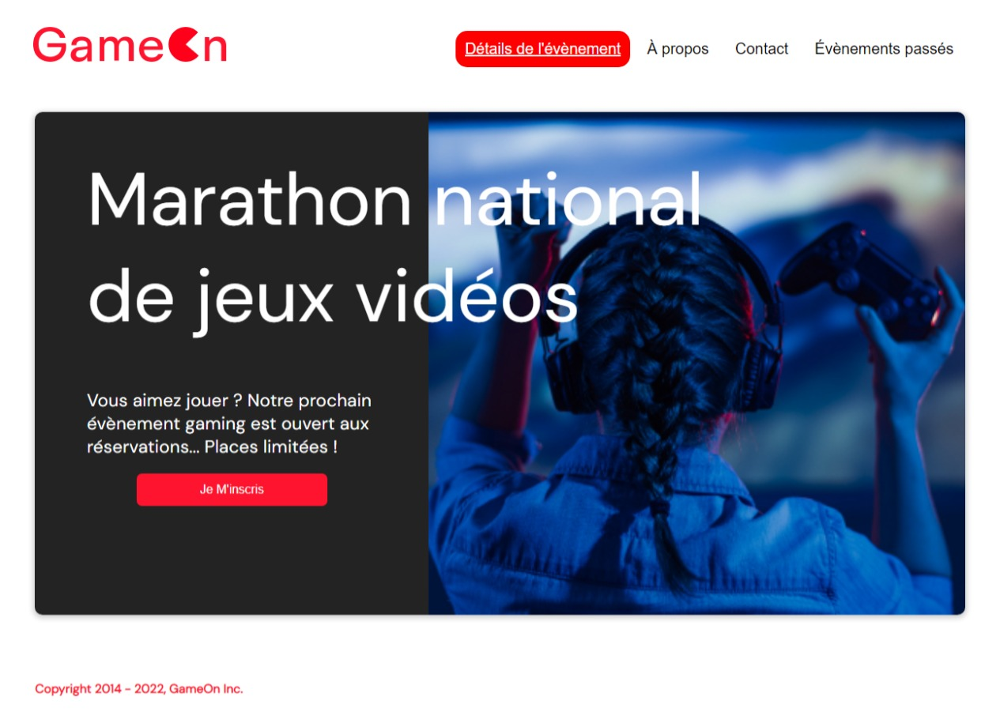
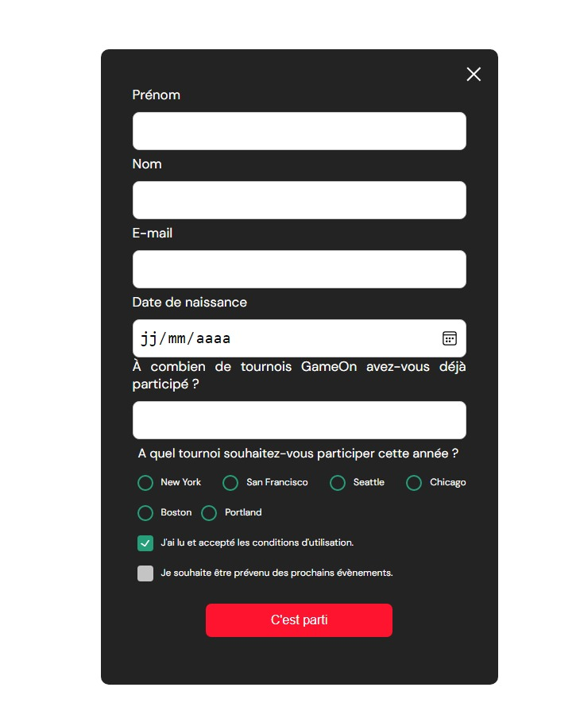
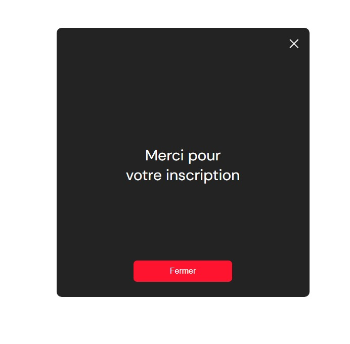

# GameOn

Vous avez récemment été embauché comme développeur Front-End junior dans une PME, GameOn, spécialisée dans les conférences et les concours de jeux. Vous avez fait du shadowing de votre développeur principal, Erika, pour suivre son travail au quotidien.

## Objectifs

https://github.com/OpenClassrooms-Student-Center/GameOn-website-FR/issues

1. Ajouter la fonctionnalité au bouton (x)
2. Implémenter entrées du formulaire
3. Ajouter validation ou messages d'erreur
4. Ajouter confirmation quand envoi réussi
5. Tests manuels des navigateurs  

## Livrables

### Pages à intégrer selon les maquettes

- **Page d’accueil**

- **Modal**

## Technologies

**Autorisés:** HTML / CSS / JS

**Interdit:** Frameworks Javascript / Frameworks CSS

## Notes

**Contraintes :**
- Utiliser que du CSS personnalisé et du JavaScript pur, sans jQuery, Bootstrap ou autre librairie.
- Validation W3C HTML : à passer, warning autorisés
- Validation W3C CSS : à passer, warning autorisés
- Compatibilité : Dernières versions de Chrome, Firefox & Safari

